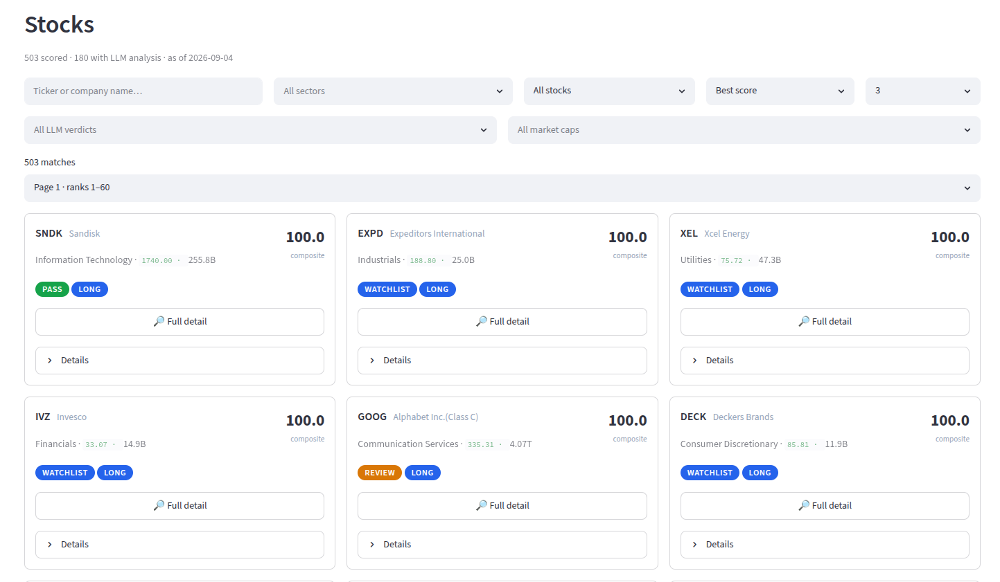
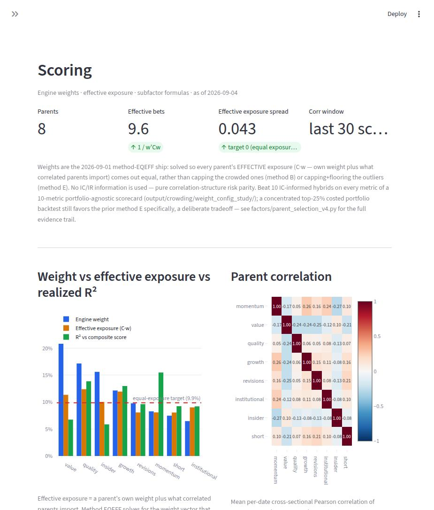
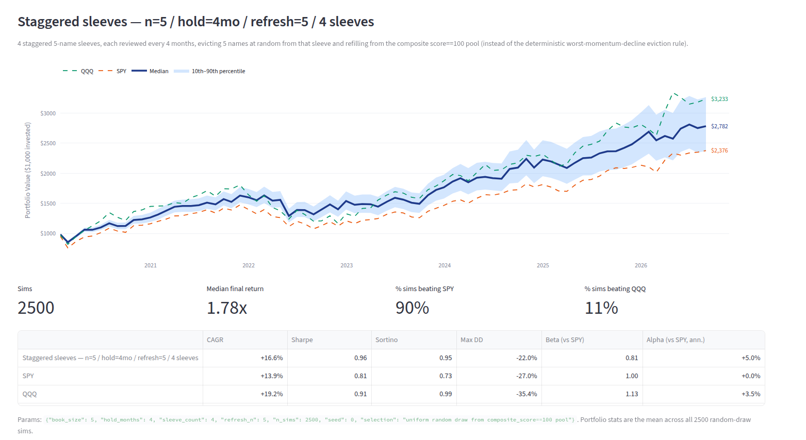
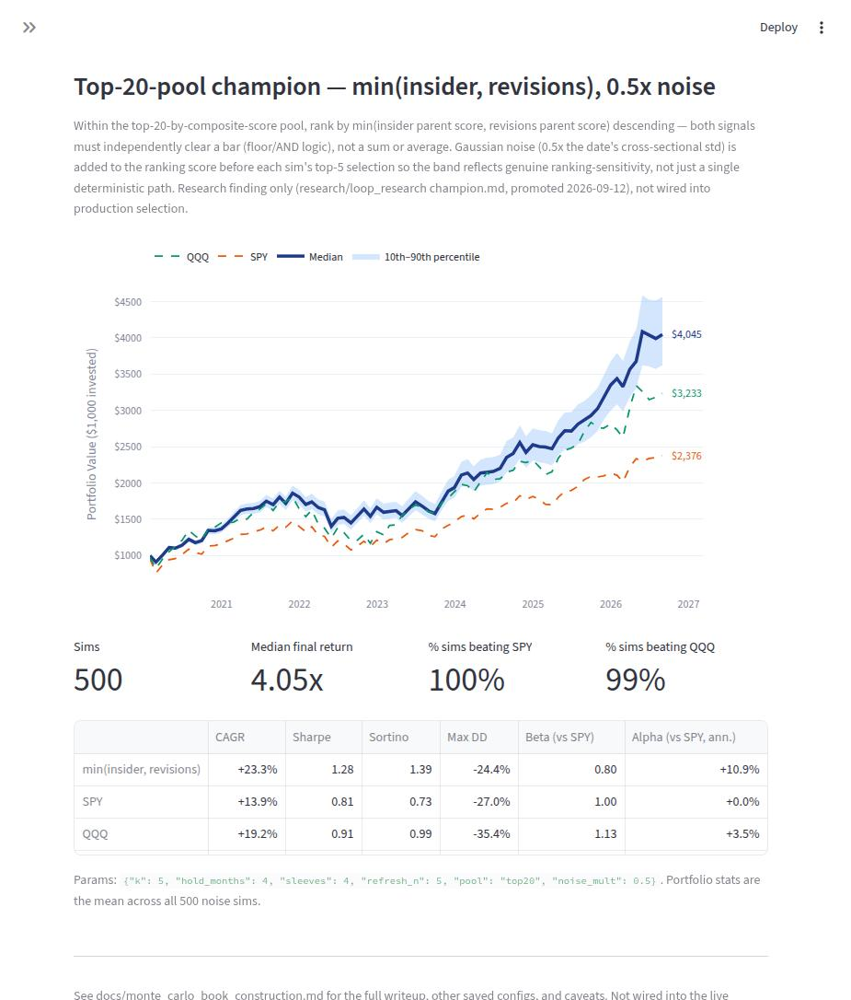

<div align="center">

# 📡 Mahajan Hedge Fund

**A systematic equity research platform that screens ~500 stocks, scores them on 8 independent factors, and picks the best.**

</div>

---

## Overview

Every stock in the universe is scored on **8 parent factors** — momentum,
value, quality, growth, revisions, institutional ownership, insider
activity, and short interest — each built from 2–3 underlying subfactors
(24 in total).

A subfactor only earns a place in the composite if it clears a bar first:
its predictive power is tested against **5 years of history**, measuring
the Information Coefficient (Spearman correlation between the factor score
and each stock's forward return) before it's ever allowed to move a live
ranking. Nothing goes into the score without evidence it actually predicts
returns.

Those validated factors are then blended into a single **composite score**
per stock — not with an arbitrary weighting, but by solving for the exact
weight vector that makes every factor's *effective* risk contribution equal,
accounting for how correlated it is with the others. The result: a ranked,
explainable score across the whole universe, refreshed daily, with every
component visible in the dashboard below.

> **No look-ahead, ever.** Every feature, score, and backtest is built to
> only see what was actually knowable on that date. This is the one rule
> that overrides every other design decision in this project.

---

## 🃏 The Screener

Every scored ticker as a filterable card grid — composite score, sector,
market cap, and a long/short/watch verdict — sorted best-first.



- **Filter** by sector, score band, market cap, or LLM research verdict
- **Search** any ticker or company name directly
- Click through to a full factor breakdown for any name

---

## ⚖️ Scoring — What's Actually Driving the Ranking

This is the composite engine's own accountability page: it shows *exactly*
how much each factor counts, and whether the blend is honest about it.



**How to read it:**

- **Blue bars** — each factor's nominal engine weight
- **Orange bars** — its *effective* exposure: nominal weight plus whatever
  it "imports" from correlated factors. Two positively-correlated factors
  quietly double up on the same risk unless this is accounted for
- **Green bars** — realized R² against the actual composite output, i.e.
  how much the factor really moves the final ranking, not just its weight
- **Heatmap** — the correlation structure the weights are solved against,
  recomputed from the trailing 30 scoring dates so it reflects current
  market crowding, not a stale snapshot

The weights are solved so every **orange bar comes out equal** — a
factor-neutral risk-parity blend, with no Information Coefficient or IR fed
into the weighting itself. That separation is deliberate: the 5-year IC
history decides whether a factor is *allowed in at all*; it plays no part
in *how much weight* it gets once it's in.

---

## 🎲 Monte Carlo — Does the Selection Rule Actually Matter?

A composite score alone leaves ties — dozens of names bunched at the top,
all roughly interchangeable by score. Given a fixed book size and holding
period, *how* those ties get broken has a real, testable effect on returns.
Rather than trust a single historical backtest (one path, one draw of
which tied names happened to end up in the book), every selection rule
here is stress-tested with simulation.

### Baseline: uniform random draw

2,500 simulations of a staggered, 4-sleeve book (5 names per sleeve,
4-month holds), drawing uniformly at random from the tied pool each time —
against SPY and QQQ:



| | CAGR | Sharpe | Max DD |
|---|---|---|---|
| Random baseline | +16.6% | 0.96 | −22.0% |
| SPY | +13.9% | 0.81 | −27.0% |
| QQQ | +19.2% | 0.91 | −35.4% |

Even picking *randomly* among the top-tied names beats SPY on Sharpe and
drawdown — evidence the composite score is doing real work just getting a
name into the tied pool in the first place.

### The champion tie-break rule

Within the top-20-by-composite pool, rank by **`min(insider score, revisions
score)`** — both insider buying conviction *and* analyst/revisions momentum
have to independently clear a bar. Not a sum, not an average: a strict
floor. Simulated the same way, but with 0.5x Gaussian noise added to the
ranking score on every single sim, so the result reflects genuine
ranking-robustness rather than one lucky deterministic ordering:



| | CAGR | Sharpe | Sortino | Max DD | Alpha vs SPY |
|---|---|---|---|---|---|
| **min(insider, revisions)** | **+23.3%** | **1.28** | **1.39** | −24.4% | **+10.9%** |
| SPY | +13.9% | 0.81 | 0.73 | −27.0% | +0.0% |
| QQQ | +19.2% | 0.91 | 0.99 | −35.4% | +3.5% |

Beats SPY in **100%** of simulations and QQQ in **99%**, even with ranking
noise injected on every draw.

### Why the result holds up

A win rate alone is easy to fool yourself with — one lucky historical
window can look like a robust edge. This rule was pressure-tested harder
than that:

- **Paired against its actual baseline**, not SPY: uniform random draw from
  the *same* top-20 pool, same sleeve mechanics. Sharpe 1.26 vs. 0.96, alpha
  +10.8% vs +4.7%, a **99.2%** paired win rate across 500 seeded sims.
- **Significance checked the honest way**: monthly returns are serially
  correlated (4-month holds, staggered reviews), so a naive t-test
  overstates confidence. A moving-block bootstrap over calendar time
  (which respects that correlation) still excludes zero.
- **Leave-one-year-out**: removing any single calendar year from the
  history, the edge survives on the remaining years — it isn't being
  carried by one lucky year.
- **Noise-perturbation**: the 0.5x noise baked into the chart above isn't
  cosmetic — the edge was also checked at 1x, 1.5x, 2x noise, and degrades
  gracefully rather than collapsing, meaning the underlying ranking signal
  is real and not a razor-thin ordering effect.

**Status:** a validated research finding, not yet wired into the live
daily scoring pipeline.

---

## Quick Start

```bash
cp .env.example .env               # fill in data-provider API keys
python run_data.py                 # incremental data pull + feature build
python run_scoring.py              # composite scoring
streamlit run dashboard/app.py     # the dashboard above, at localhost:8501
```

`run_pipeline.py` wires the first two into one daily run. See
`docs/monte_carlo_book_construction.md` for reproducing the Monte Carlo
charts and `docs/ARCHITECTURE.md` for the data-layer design.
